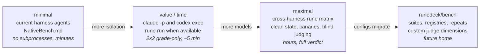
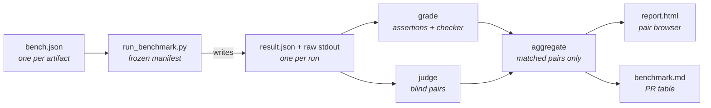
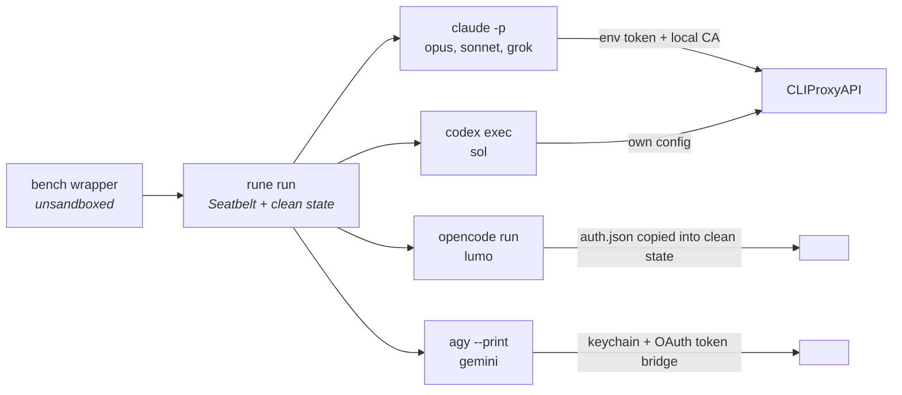
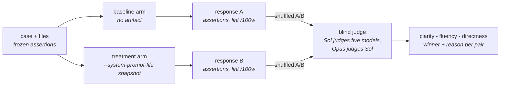
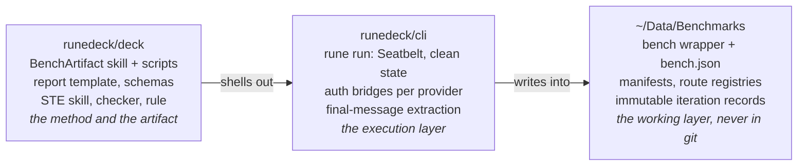

# BenchArtifact Anatomy

How one artifact benchmark moves from a configuration file to a pull-request table. The diagrams record the system as built for the Simplified Technical English iteration-4 run (2026-08-19). Decision records: [DECK-0001](decisions/DECK-0001%20Artifact%20Benchmarking%20Skill.md), [DECK-0002](decisions/DECK-0002%20Benchmark%20Execution%20Ladder.md), [DECK-0003](decisions/DECK-0003%20Three-Metric%20Verdict%20and%20Cross-Vendor%20Judging.md).

## The execution ladder

Four setups, one method. Each rung buys more isolation and more models for more time. The manifest, assertions, checker, and verdict rule stay identical on every rung, so results stay comparable as you climb.

The absolutely minimal setup runs inside the current harness. The best value-for-time setup drives Claude and Codex directly. The maximal setup is the full matrix. The best evaluations will run from runedeck/bench.

## The pipeline

Every consumer reads files, never memory. Records freeze as they land: the manifest freezes per iteration, results never get overwritten, and each output feeds exactly one consumer.

## Six models, four authentication mechanisms

Every lane ends in the `rune run` JSON envelope, but each harness authenticates differently. Keychain-backed authentication only works outside the agent sandbox, so the whole pipeline runs through one excluded wrapper command.

The baseline arm gets no artifact. Gemini's agy lane still fails on real-length prompts; the failure signature is recorded in the iteration-4 and iteration-5 records.

## One pair, three verdicts

Each case runs twice per model: identical prompt, files, and mode; only the artifact differs. Judging is blind and cross-vendor so no model grades its own vendor's output.

The verdict rule reads the three signals together: assertions must hold (meaning), checker density must fall (the claimed behavior), and blind preference must stay acceptable (prose). Iteration-4: true for Opus and Sonnet, neutral for Sol, inverted for Grok and Lumo.

## Where things live

When runedeck/bench exists, the workspace wrapper and its configurations move there. The deck keeps the method definition; the cli keeps execution.
